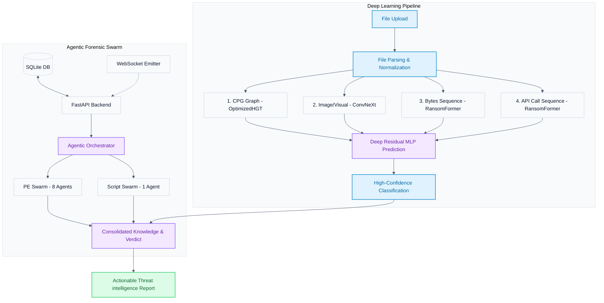
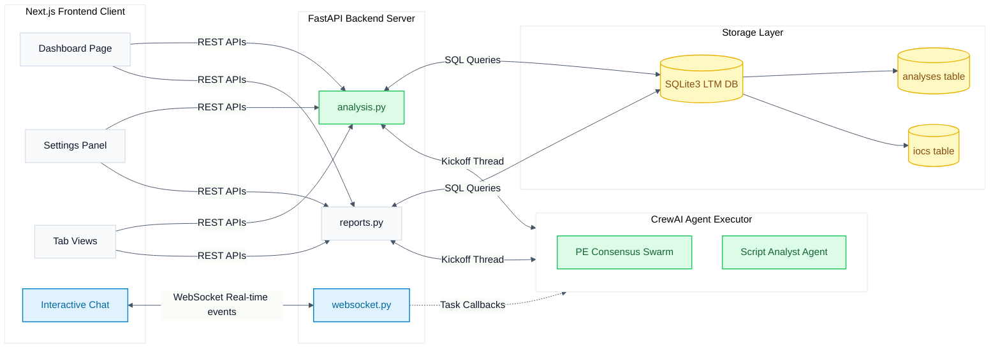
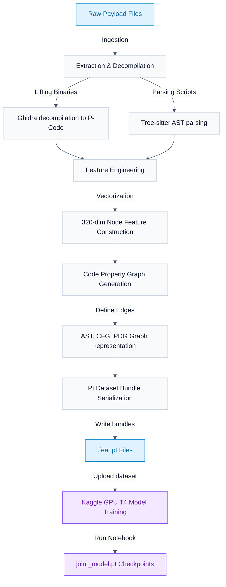
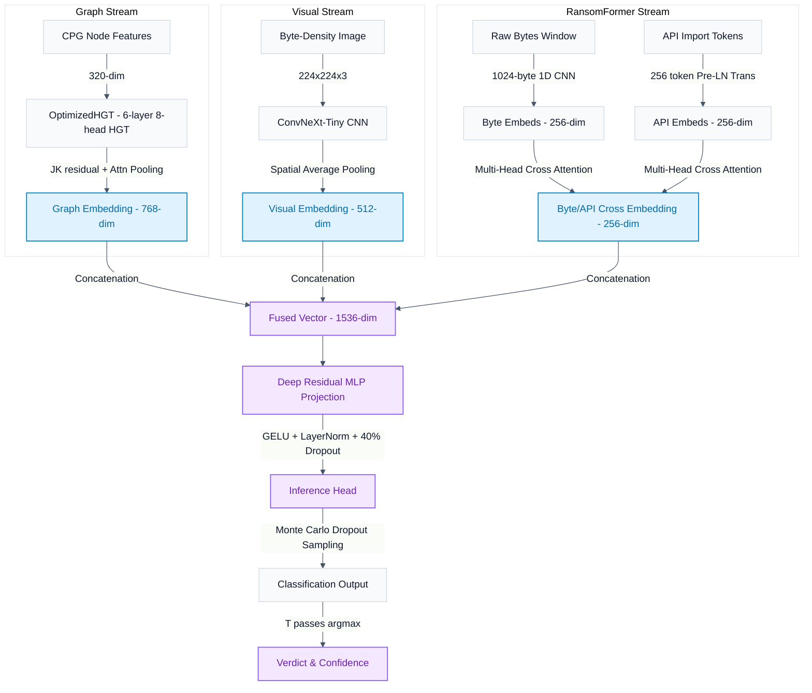
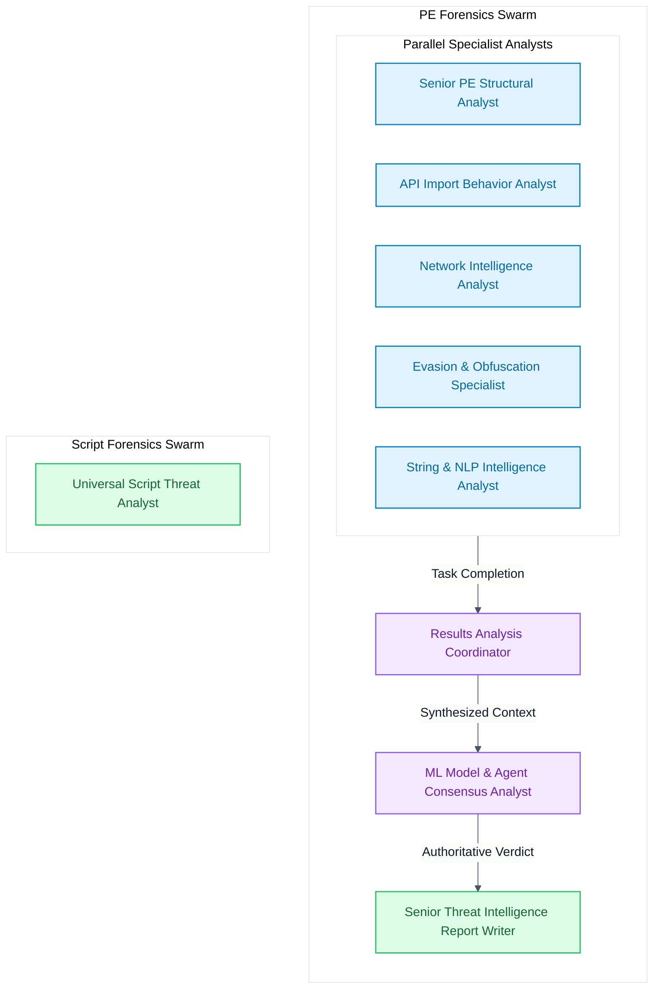
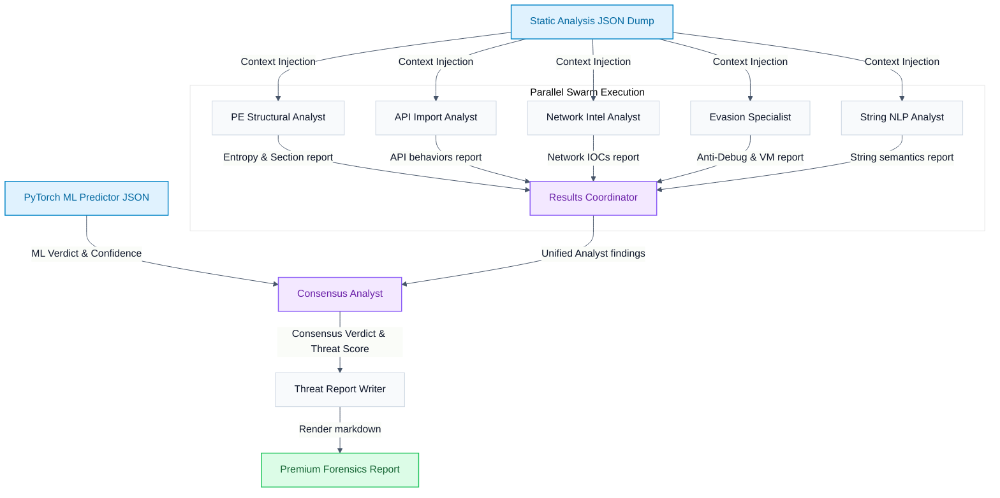
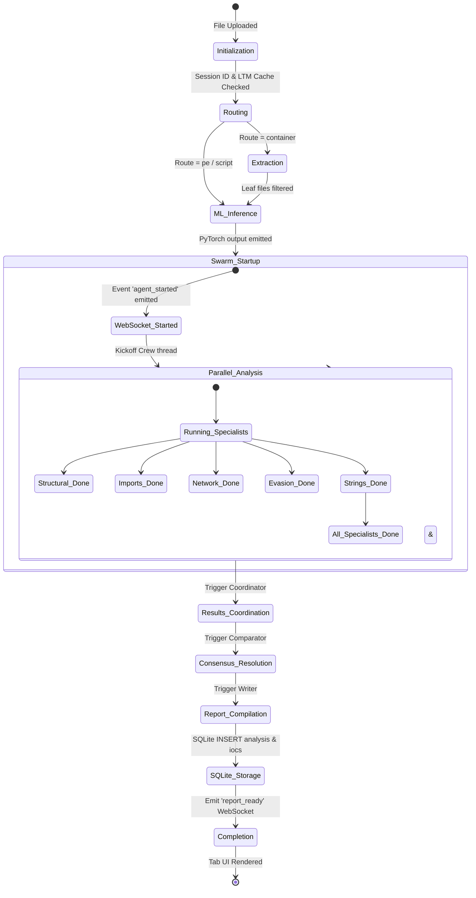

# ViGil Malware Forensics Platform — System Diagrams Reference

This document compiles the light-theme high-resolution system diagrams for the ViGil Quad-Modal and Agentic Threat Forensics Platform. It includes links to generated high-resolution assets and responsive Mermaid vector specifications for all 7 architectural views.

---

## 1. Full System Architecture
Illustrates the end-to-end payload analysis flow, detailing the parallel paths of the Deep Learning pipeline and the Agentic swarm.

---

## 2. Agentic System Architecture
Focuses exclusively on the frontend, backend routes, database structures, and CrewAI connection flows.

---

## 3. until ML Model Training Pipeline
Illustrates the engineering flow from raw payload files down to serialization and Kaggle GPU model training.

---

## 4. ML Model Architecture
Represents the neural network design of the Quad-Modal Joint Malware Model detailing dimensional transformations and fusion.

---

## 5. AI Agents Architecture
Displays the organizational structure, roles, and groupings of the CrewAI forensic agents.

---

## 6. AI Agents Dataflow Architecture
Details how information and files route between backend analyzers, the model consensus engine, and reporting modules.

---

## 7. AI Agents State Diagram
Represents the step-by-step state machine lifecycle of the ViGil agent executor during payload threat forensics.

