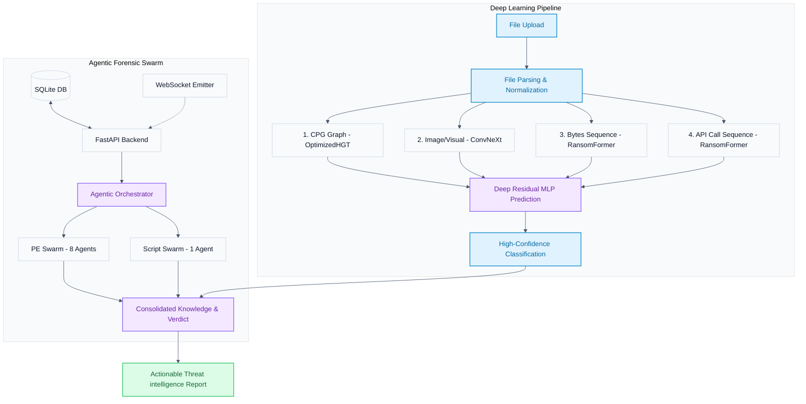
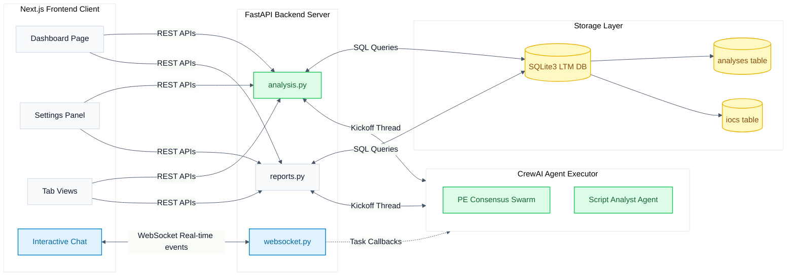
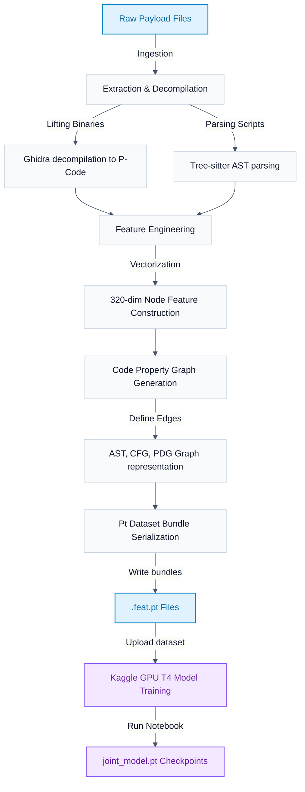
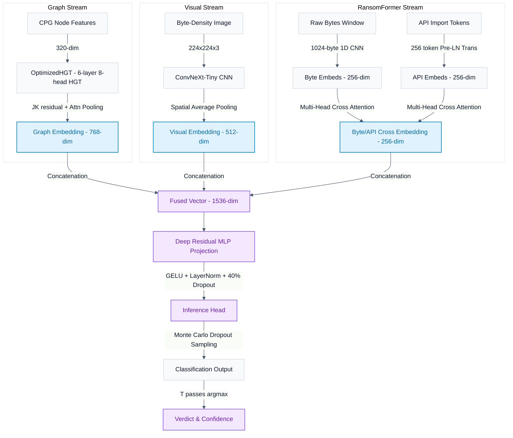
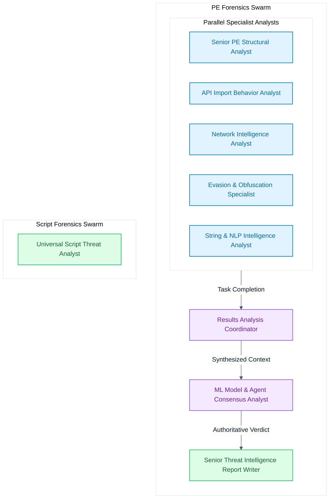
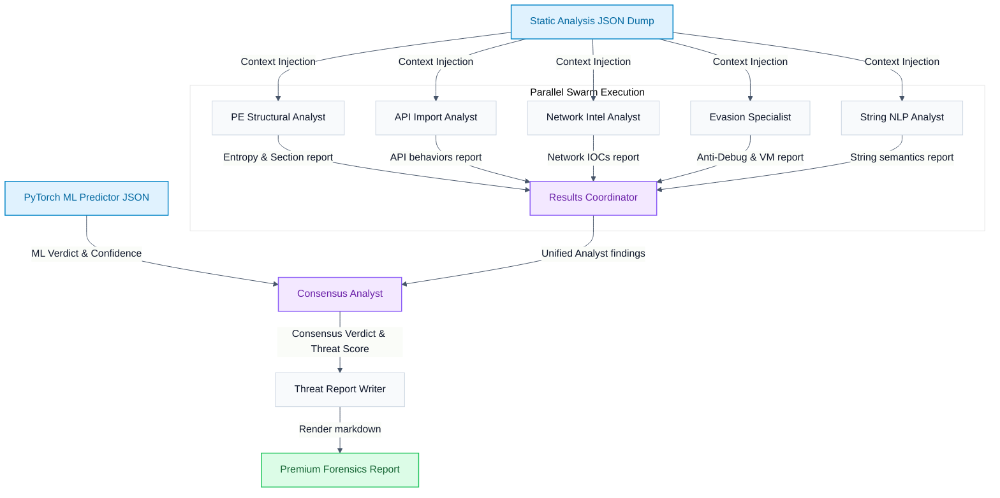
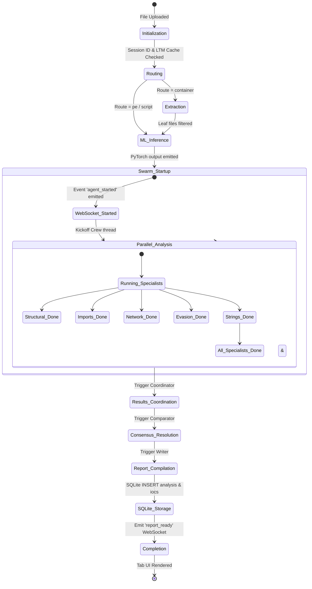

# ViGil — Comprehensive Platform Documentation & Operations Manual

This document serves as the unified single source of truth for the **ViGil Quad-Modal and Agentic Malware Forensics & Analysis Platform**. It compiles the entire system architecture, deep learning models, feature engineering schemas, agentic consensus swarms, frontend next-generation dashboards, database layouts, operational workflows, and all 7 light-theme system diagrams.

---

## Table of Contents
1. [System Overview](#1-system-overview)
2. [Quad-Modal Deep Learning Architecture](#2-quad-modal-deep-learning-architecture)
3. [Feature Engineering & Code Property Graphs](#3-feature-engineering--code-property-graphs)
4. [Core Pipeline Execution Workflow](#4-core-pipeline-execution-workflow)
5. [Deep Learning Operations Guide](#5-deep-learning-operations-guide)
6. [Agentic System Architecture](#6-agentic-system-architecture)
7. [CrewAI Swarm & Consensus Architecture](#7-crewai-swarm--consensus-architecture)
8. [Frontend UI/UX Architecture](#8-frontend-uiux-architecture)
9. [Modern Forensic Report Specification](#9-modern-forensic-report-specification)
10. [Platform Diagrams Reference](#10-platform-diagrams-reference)

---

## 1. System Overview

ViGil is an advanced, high-performance malware analysis and classification platform designed to handle extreme file format heterogeneity (executables, scripts, documents, installers, launchers) through a joint dual-engine strategy:

1. **The Quad-Modal Deep Learning Engine**: Extracts features across four distinct semantic modalities (CPG graph structure, visual byte-density image, raw byte sequences, and tokenized API call imports) and fuses them to compute class verdicts and epistemic uncertainty using Monte Carlo dropout.
2. **The Agentic Forensics Consensus Swarm**: An asynchronous FastAPI/Uvicorn backend coordinating a specialized swarm of stateless CrewAI security agents. It decompiles payloads, extracts indicators of compromise (IOCs), maps threats to the MITRE ATT&CK framework, and compiles human-readable forensics reports.

```
                    ┌────────────────────────────────────────────────────────────┐
   File             │                 ViGil Quad-Modal Model                      │
   ──────►  CPG  ──►│  OptimizedHGT   (768-dim, JK+attn pool)                   │
           Image ──►│  ConvNeXt-Tiny  (512-dim)                                  ├──► DeepResMLP ──► BENIGN / MALWARE
           Bytes ──►│  AttentionByte  (256-dim)  ─ cross-modal ─►                │                + Confidence %
            APIs ──►│  CLSTransformer (256-dim)                                  │                + Uncertainty
                    └────────────────────────────────────────────────────────────┘
                               Fused: 768 + 512 + 256 = 1536-dim
```

---

## 2. Quad-Modal Deep Learning Architecture

The joint neural network model (implemented in `OptimizedHGT` and `JointMalwareModel` inside `uir/model/optimized_models.py`) integrates four specialized input streams:

### A. Graph Stream (CPG & OptimizedHGT)
- **Data Source**: Code Property Graph (CPG) built from machine code (P-Code) or script Abstract Syntax Trees (AST).
- **Encoder**: `OptimizedHGT` — a 6-layer, 8-head Heterogeneous Graph Transformer.
- **Aggregation**: Incorporates Jumping Knowledge (JK) residual pathways connecting intermediate layers, and applies a global attention pooling mechanism over all graph nodes.
- **Output Dimension**: **768-dimensional** vector.

### B. Visual Stream (ConvNeXt-Tiny)
- **Data Source**: Grayscale byte-density image of size $224 \times 224 \times 3$ mapped from the raw file bytes.
- **Encoder**: `OptimizedCNN` — utilizes a `ConvNeXt-Tiny` backbone pre-trained on ImageNet to classify binary texture/packing signatures.
- **Output Dimension**: **512-dimensional** vector.

### C. Raw Bytes & API Imports Stream (RansomFormer)
- **Raw Bytes**: A $1 \times 1024$ byte-density window processed via a 3-layer 1D CNN with max pooling and attention pooling (`OptimizedByteEncoder`). Yields a 256-dim output.
- **API Imports**: A sequence of 256 tokenized API IDs processed via a 4-layer Pre-LN Transformer encoder with local 1D CNN branches (`OptimizedAPIEncoder`). Yields a 256-dim output.
- **Fusion**: `OptimizedRansomFormerEncoder` — computes multi-head cross-attention where raw byte outputs represent the Query ($Q$), and API token outputs represent the Key ($K$) and Value ($V$).
- **Output Dimension**: **256-dimensional** cross-modal embedding.

### D. Fusion Head (Deep Residual MLP)
- **Concatenation**: Combines Graph, Visual, and RansomFormer embeddings into a **1536-dimensional** joint representation.
- **Classification Head**: Projects features to size 1024, followed by GELU, LayerNorm, 40% dropout, and a residual shortcut. The output layer projects to 2 classes (BENIGN vs. MALWARE).
- **Uncertainty Estimation**: Employs **Monte Carlo (MC) dropout** at inference. Executing $T$ iterations with active dropout filters yields a probability distribution. The final verdict is the class argmax of the mean probabilities, and the variance maps the model's epistemic uncertainty.

---

## 3. Feature Engineering & Code Property Graphs

### CPG Schema Definition
The Code Property Graph merges multiple representation paradigms:
1. **AST Edges (`IS_AST_PARENT`)**: Represents the syntactic hierarchy.
2. **CFG Edges (`FLOWS_TO`)**: Maps execution control flows and branch targets.
3. **PDG Edges (`REACHES`, `CONTROLS`)**: Evaluates data dependency chains (def-use chains) and control dependencies.

### 320-Dimensional Node Feature Layout
The dataset builder (in `uir/model/dataset.py`) vectorizes every graph node into a 320-dimensional feature vector:

| Dimension Range | Feature Category | Description |
| :--- | :--- | :--- |
| `[0..10]` | Node Type | One-hot encoding of node types (e.g. Method, Block, Call, Literal). |
| `[11..13]` | Degree Centrality | Log-normalized in-degree, out-degree, and total degree centrality. |
| `[14..21]` | Typed In-Degrees | In-degrees categorized by the 8 edge types. |
| `[22..29]` | Typed Out-Degrees | Out-degrees categorized by the 8 edge types. |
| `[30]` | External Flag | 1.0 if the node represents an external library API import, 0.0 otherwise. |
| `[31]` | Line Number | Normalized code line number. |
| `[32..99]` | Name n-grams | 68-dimensional multi-hashed character n-gram fingerprint for identifiers. |
| `[100..131]` | Block Composition | One-hot count of statements (If, While, Load, Store) inside the block. |
| `[132]` | Cyclomatic Complexity | Cyclomatic complexity metric (applicable for METHOD nodes). |
| `[133]` | API Call Count | Total external calls invoked (applicable for METHOD nodes). |
| `[134]` | Total Instructions | Count of instructions contained (applicable for METHOD nodes). |
| `[135]` | Basic Block Count | Number of basic blocks in method (applicable for METHOD nodes). |
| `[136]` | Outgoing Calls | Count of outgoing method call edges. |
| `[137]` | Instruction Entropy | Shannon entropy of instruction type distribution (applicable for BLOCK nodes). |
| `[138]` | Jump Ratio | Ratio of branches and jumps to total instructions (applicable for BLOCK nodes). |
| `[139]` | Memory Access Ratio | Ratio of memory Load/Store operations to total instructions (applicable for BLOCK nodes). |
| `[140]` | Call Ratio | Ratio of calls to total instructions (applicable for BLOCK nodes). |
| `[141]` | Block Size | Normalized basic block instruction count (applicable for BLOCK nodes). |
| `[142..209]` | Suspicious API Match | 68-dimensional multi-hashed fingerprint mapping calls to sensitive Windows APIs. |
| `[210..277]` | Global Import BoW | 68-dimensional global bag-of-words representation of all PE imports. |
| `[278]` | Architecture | x86 = 1.0, x64 = 0.67, ARM = 0.33, Unknown = 0.0. |
| `[279]` | Subsystem | Subsystem identifier (normalized Windows subsystem ID). |
| `[280]` | File Type | Normalized extension mapping (exe, dll, sys, elf, macho, so). |
| `[281]` | PE Timestamp | Log-normalized compiler timestamp. |
| `[282]` | Import Count | Log-normalized count of PE imports. |
| `[283]` | String Count | Log-normalized count of extracted strings. |
| `[284]` | Export Count | Log-normalized count of PE exports. |
| `[285..319]` | Reserved | Zeros reserved for future structural expansions. |

---

## 4. Core Pipeline Execution Workflow

The extraction and normalization pipeline executes sequentially:

1. **Identification**: Classifies target files using MIME-types (`libmagic`) and byte signatures (`TrID`).
2. **Recursive Unpacking**: Archives (`.zip`, `.rar`, `.7z`), disk images (`.iso`), and installers (`.msi`) are unpacked recursively up to a depth of 5. Payne/relational tables of MSI installer database scripts are dumped to extract setup payloads.
3. **Lifting & Decompilation**:
   - **Binaries**: Headless Ghidra decompiles machine code to register-neutral P-Code micro-instructions.
   - **Scripts**: Transpiled into ASTs. Obfuscated JavaScript/PowerShell are emulated dynamically (using tools like `box-js`) to resolve packed payloads.
   - **Documents**: Macro scripts are extracted using `olevba`; high-entropy visual byte streams are emulated to capture shellcode.
   - **Launchers**: Target paths and argument vectors of LNK shortcuts are parsed and modeled synthetically.
4. **CPG Serialization**: Generates unified CPG JSON files, which are serialized into PyTorch `.feat.pt` dataset bundles.

---

## 5. Deep Learning Operations Guide

### Procedure A: Local Feature Extraction
Use the `uir` batch processor CLI to generate `.feat.pt` files locally:
```bash
# Process malware samples
uir batch --input-dir ./dataset/malwares --output-dir ./features/malwares --device-profile m4

# Process benign samples
uir batch --input-dir ./dataset/benigns --output-dir ./features/benigns --device-profile m4
```
*Profiles (`--device-profile`)*: `m4` (Apple Silicon unified memory), `gtx_1650_ti` (4GB NVIDIA VRAM bounds), `cpu_default` (multi-core CPU).

### Procedure B: Kaggle Model Training
1. **Zip Feature Bundles**:
   ```bash
   zip -r vigil_features.zip features/**/*.feat.pt
   ```
2. **Zip Project Source Code**:
   ```bash
   zip -r vigil_src.zip uir/ predict.py export_zip.py setup.py traning_notebook/
   ```
3. **Upload & Train**:
   - Create a Kaggle Notebook and import `traning_notebook/vigil.ipynb`.
   - Add both zip archives as datasets (`vigil-features` and `vigil-src`).
   - Enable **Accelerator: GPU T4 x2** (or P100) and **Internet** in settings.
   - Execute training; download the saved `joint_model.pt` weights.

### Procedure C: Standalone Inference
Inference can be run locally using the standalone `predict.py` script:
```bash
# Place checkpoint in directory
mkdir -p models/01/models
mv joint_model.pt models/01/models/joint_model.pt

# Run standard prediction
python predict.py --file suspicious.exe

# Custom MC sampling iterations and verbose logs
python predict.py --file target.dll --samples 30 --verbose
```

### Procedure D: Exporting Deployment Bundles
Export the active model checkpoint along with the standalone predictor and code dependencies to distribute ViGil:
```bash
python export_zip.py --checkpoint models/01/models/joint_model.pt --output vigil_deploy.zip
```

---

## 6. Agentic System Architecture

The Agentic System is built on a decoupled, asynchronous structure coordinating Next.js, FastAPI, SQLite, and the CrewAI agent executor.

### A. FastAPI Backend Routes (`backend/routes/`)
- **`analysis.py`**: Ingests files, runs the pipeline router, triggers the orchestrator, and returns db results.
- **`reports.py`**: Formats reports in Markdown and serves `.md` downloads or formatted HTML views.
- **`settings.py`**: Manages environment settings and API keys for the 6 providers.
- **`websocket.py`**: Runs the global status room (`/ws/global`) and individual analysis sessions (`/ws/analysis/{id}`).

### B. Core Orchestrator & WebSocket Events
- **`backend/core/orchestrator.py`**: Runs the state machine: checks memory cache $\rightarrow$ routes payload $\rightarrow$ extracts containers $\rightarrow$ triggers PyTorch ML prediction $\rightarrow$ executes CrewAI agent crews $\rightarrow$ synthesizes consensus verdict $\rightarrow$ saves to database.
- **`backend/core/event_emitter.py`**: Emits step progress updates and agent completion messages live via WebSockets.

### C. Persistent Storage Scheme
- **`backend/memory/long_term.py`**: Manages the SQLite database at `data/vigil_memory.db`.
  - **`analyses` table**: Stores analysis sessions, SHA256 hashes, filenames, verdicts, matrix scores, and full report markdown.
  - **`iocs` table**: Stores network indicators, registry changes, and file paths parsed from the payloads, foreign-keyed to the analyses table.

---

## 7. CrewAI Swarm & Consensus Architecture

### A. PE Analysis Crew (`pe_crew.py`)
Executes an 8-agent swarm to analyze Portable Executable binaries:
1. **Parallel Specialist Swarm**: 5 parallel agents (Structural, API Import, Network, Evasion, String) analyze components concurrently (`async_execution=True`).
2. **Results Analysis Coordinator**: Compiles parallel findings, checking for correlation and contradictions.
3. **ML Model & Agent Consensus Analyst**: Compares the PyTorch model prediction against the coordinator's report to resolve the final verdict, confidence, and score.
4. **Senior Threat Intelligence Report Writer**: Writes the unified markdown forensics report.

### B. Script Analysis Crew (`script_crew.py`)
Utilizes a high-performance single-agent pipeline:
- **Agent**: `Universal Script Threat Analyst`.
- **Goal**: Classifies scripting languages, deobfuscates code, detects credential theft or LOLBin abuses, and maps findings to MITRE ATT&CK.

### C. Stateless Execution & Callbacks
Crews run inside the event loop executor to prevent blockages. Completion events are forwarded to the WebSocket handler via thread-safe callbacks:
```python
def make_callback(agent_role: str, next_agent_role: Optional[str] = None):
    def task_callback(task_output):
        asyncio.run_coroutine_threadsafe(
            event_emitter.emit_agent(
                analysis_id=analysis_id,
                agent_name=agent_role,
                event_type=EventType.AGENT_COMPLETED,
                data={"output": task_output.raw}
            ),
            loop
        )
```
To optimize token costs and speed up execution, unified RAG memory modules are deactivated (`memory=False`) at both the crew and individual agent level.

---

## 8. Frontend UI/UX Architecture

The frontend is a Next.js 15 application utilizing React 19, styled using modern glassmorphism principles.

### Page Routes & Components
- **Dashboard (`src/app/page.js`)**: Displays the dashboard. Features a split hero header with a glass-card enclosing the large pulsing SVG symbol, the file drag-and-drop zone (`FileUpload.jsx`), engine status metrics, and a table of recently processed files.
- **Settings (`src/app/settings/page.js`)**: Manages active LLM provider details and tests connection latency.
- **Forensics Chat (`src/app/analysis/[id]/page.js` -> `AgentsChat.jsx`)**: Streams progress as a live group chat. Renders overlapping avatar stacks for parallel analysts, updates dynamic status labels (e.g. *"Evasion Specialist and 3 other agents are analyzing"*), and displays agent outputs as expandable bubbles.
- **Report Viewer (`ReportViewer.jsx`)**: Renders Markdown elements, alerts, and tables. Contains controls to Copy, Print, or Download the `.md` report.

---

## 9. Modern Forensic Report Specification

Generated threat reports follow a premium, standardized Markdown format parsed dynamically by `ReportViewer.jsx`:

1. **Branding Header**:
   ```markdown
   # THREAT INTELLIGENCE & FORENSICS REPORT
   ```
2. **Authoritative Verdict Block**: Displays the final consensus verdict, confidence, and ViGil Threat Matrix Score in large H1 and H2 headers before the details:
   ```markdown
   # VERDICT: MALWARE
   ## CONFIDENCE: 88% | VIGIL THREAT MATRIX SCORE: 75/100
   ---
   ```
3. **Executive Summary Alert Panel**: Renders inside a glassmorphic warning or caution blockquote:
   ```markdown
   ## 1. Executive Summary
   > [!CAUTION]
   > Critical threat signatures detected. The binary contains obfuscated strings...
   ```
4. **File Metadata Table**: Uses Markdown tables for clean alignment:
   ```markdown
   ## 2. File Metadata & Overview
   | Property | Value |
   | --- | --- |
   | File Name | payload.exe |
   | SHA256 Hash | 0a6c17dc3e... |
   ```
5. **Consensus Logic**: Explains ML model inferences and agent agreements.
6. **Technical Analysis**: Static findings, packers detected, and evasion APIs.
7. **C2 & Network IOCs Table**: Maps IP/Domains with reputation ratings.
8. **MITRE ATT&CK Mapping Table**:
   ```markdown
   ## 5. MITRE ATT&CK Mapping
   | Tactic | Technique ID | Technique Name | Evidence / Abuse Details |
   | --- | --- | --- | --- |
   | Defense Evasion | T1027 | Obfuscated Files | Base64-encoded payload string |
   ```
9. **Mitigation Checklists**: Actionable security recommendations.

---

## 10. Platform Diagrams Reference

The following are the 7 architectural diagrams representing the platform.

### A. Full System Architecture
Illustrates the end-to-end payload analysis flow, detailing the parallel paths of the Deep Learning pipeline and the Agentic swarm.




### B. Agentic System Architecture
Focuses exclusively on the frontend, backend routes, database structures, and CrewAI connection flows.




### C. until ML Model Training Pipeline
Illustrates the engineering flow from raw payload files down to serialization and Kaggle GPU model training.




### D. ML Model Architecture
Represents the neural network design of the Quad-Modal Joint Malware Model detailing dimensional transformations and fusion.



### E. AI Agents Architecture
Displays the organizational structure, roles, and groupings of the CrewAI forensic agents.



### F. AI Agents Dataflow Architecture
Details how information and files route between backend analyzers, the model consensus engine, and reporting modules.



### G. AI Agents State Diagram
Represents the step-by-step state machine lifecycle of the ViGil agent executor during payload threat forensics.


